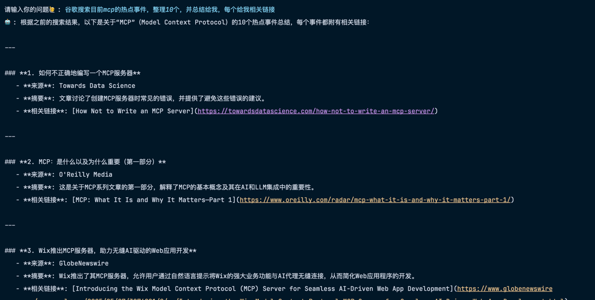

## MCP Server
参考：https://github.com/yestarz/mcp-server-weather

> 本项目有两个server
> 
> 1、基于和风天气API的一个获取实时天气的MCP服务端，使用Java来实现。和风天气API文档：https://dev.qweather.com/docs/api/weather/weather-now/
> 
> 2、基于serperAPI的一个搜索引擎API，主要用于进行基于google搜索结果的查询,serper请求示例:https://serper.dev/playground
> 
> 后续可以继续扩充

## 可用的工具列表

- 获取实时天气
- 进行谷歌搜索结果查询

## 使用方法

1. 下载项目到本地
2. 在application.yml中配置和风天气key和serper key
3. 修改WeatherService中的String citySearchApiUrl = "https://your.host.com/geo/v2/city/lookup"; 和 HttpUtil.createGet("https://your.host.com/v7/weather/now")，替换成自己的host
4. 打包项目，生成jar包 `mvn clean package -Dmaven.test.skip=true`

## LangChain4J使用方法：

引入依赖：
```xml
     <dependency>
        <groupId>dev.langchain4j</groupId>
        <artifactId>langchain4j</artifactId>
    </dependency>
    <dependency>
        <groupId>dev.langchain4j</groupId>
        <artifactId>langchain4j-open-ai</artifactId>
    </dependency>
    <dependency>
        <groupId>dev.langchain4j</groupId>
        <artifactId>langchain4j-mcp</artifactId>
    </dependency>
```
客户端详细代码可以查看：https://github.com/Badb-Lee/mcp-client
```java

    /**
     * 阿里云的模型
     *
     * @return
     */
    @Bean
    public ChatLanguageModel chatLanguageModel() {
        return OpenAiChatModel.builder()
                .apiKey(apiKey)
                .modelName(model)
                .logRequests(true)
                .logResponses(true)
                .baseUrl(baseUrl)
                .build();
    }
    /**
     * 初始化MCP Client
     */
    @Bean
    public McpClient mcpClient() {
        return new DefaultMcpClient.Builder()
                .transport(new StdioMcpTransport.Builder()
                        .command(List.of(
                                "java",
                                "-Dspring.ai.mcp.server.stdio=true",
                                "-jar",
                                // 替换成自己macp-server jar包的路径
                                "your-jar-path",
                                "--weather.api.api-key=%s".formatted(weatherApikey),
                                "--serper.api-key=%s".formatted(serperApikey)))
                        .logEvents(true) // only if you want to see the traffic in the log
                        .build())
                .build();
    }

    /**
     * 使用LangChain4J的高级API来构建一个AI助手，注入MCP Client
     * @param mcpClient
     * @return
     */
    @Bean
    public AiAssistant aiAssistant(@Qualifier("mcpClient") McpClient mcpClient) {
        ToolProvider toolProvider = McpToolProvider.builder()
                .mcpClients(List.of(mcpClient))
                .build();
        return AiServices.builder(AiAssistant.class)
                .chatLanguageModel(chatLanguageModel())
                .chatMemory(MessageWindowChatMemory.withMaxMessages(10))
                .toolProvider(toolProvider)
                .build();
    }

    @Test
    public void testWeather(){
        System.out.println(aiAssistant.chat("现在武汉的天气怎么样？"));
    }

    @Test
    public void testHotEvent(){
        System.out.println(aiAssistant.chat("获取谷歌当前有关小米su7的热点事件"));
    }
```

测试结果：

